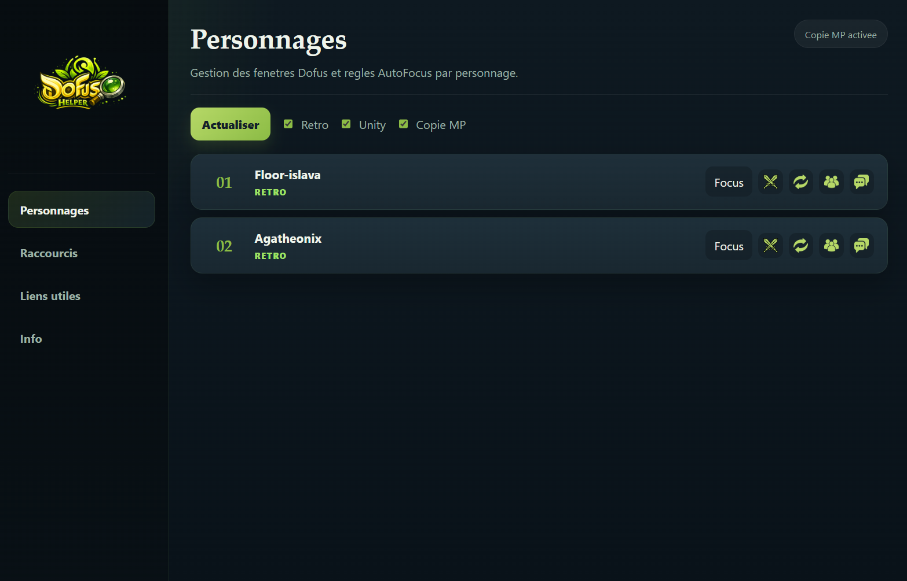
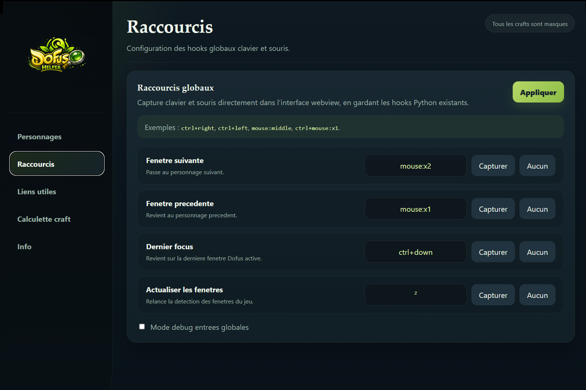
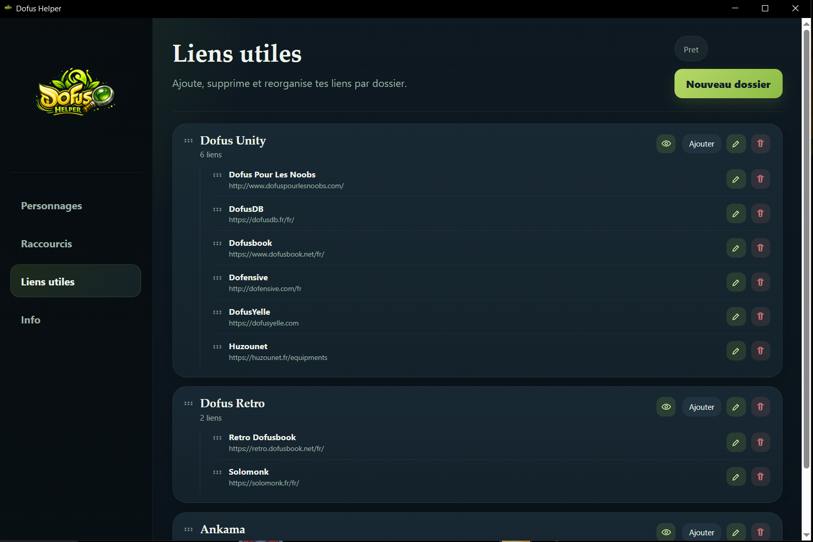
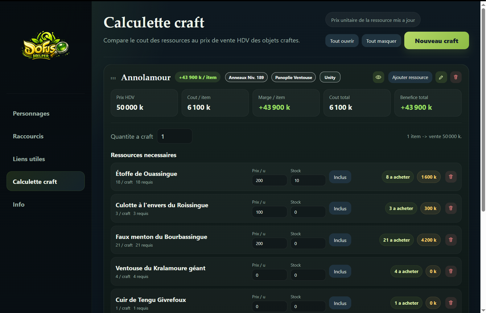
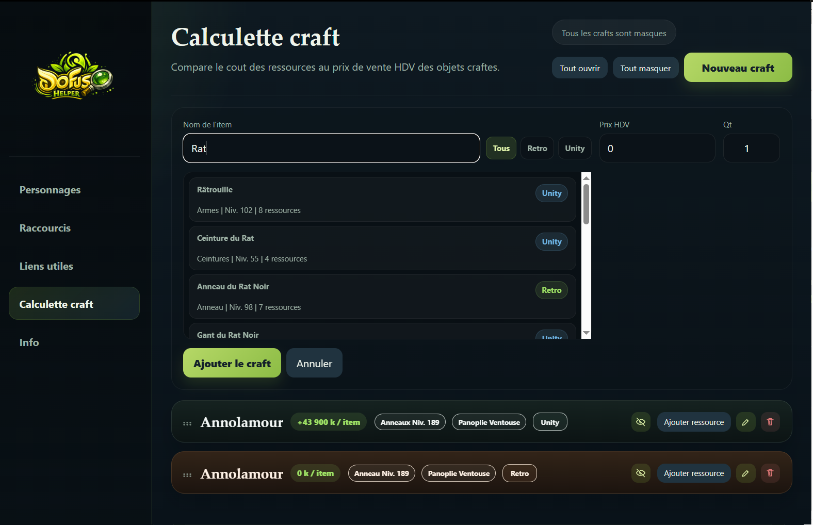

# Dofus Helper

Dofus Helper est une application à destination de joueur de **Dofus Monocompte ou Multicompte** et ce **quelque soit la version du jeu** !

Ce projet est un fork de Dracoon : [GitHub](https://github.com/Slyss42/Dracoon), [Twitter / X](https://x.com/Slyss42).

L'application comprends les fonctionnalités suivantes :

Détection des fenêtres de jeu. Switch de fenêtre avec support raccourcis clavier et souris (pour le multi-compte), focus en cas de notification (Dofus Retro et Monocompte unity). Et possibilité de se créer une banque de lien utiles, accessibles rapidement et regroupable par dossier.

## Présentation vidéo

Ci-joint une vidéo de présentation de l'outil [Dracoon](https://github.com/Slyss42/Dracoon) qui est la base de Dofus Helper.

[](https://youtu.be/6R7pPM_5euM)

---

## Cas d'utilisation

### Monocompte

- Jouer sur un seul compte tout en faisant autre chose à côté.
- L'application peut remettre automatiquement la bonne fenêtre au premier plan quand une notification importante apparaît.

### Multicompte

- Gérer plus facilement les échanges entre comptes.
- Créer et suivre des groupes de personnages.
- Naviguer rapidement entre les personnages.
- Suivre les changements d'ordre d'initiative.
- Éviter de réorganiser les fenêtres manuellement en permanence.

### Autres usages

- Aider les joueurs ayant besoin d'une navigation plus confortable ou plus accessible.

---

## Fonctionnalités

### Personnages



#### Actualiser

Le bouton `Actualiser` permet de rafraîchir l'application pour détecter les fenêtres Dofus ouvertes.

#### Filtres Retro et Unity

Les cases à cocher permettent d'activer ou de désactiver séparément la prise en charge de Dofus Retro et de Dofus Unity.

#### Copie MP

Extrait le Pseudo de la personne qui a envoyé un MP et ajoute dans le presse papiers "/w Pseudo" pour répondre rapidement à la personne.

#### Ordre des personnages

Les personnages peuvent être réordonnés par glisser-déposer pour définir l'ordre de parcours des fenêtres.

#### Actions par personnage

Pour chaque personnage, il est possible de :

- forcer le focus sur sa fenêtre avec le bouton `Focus`
- activer ou désactiver l'auto-focus selon le type de notification : combat, échange, groupe ou message privé. Cela ne fonctionne que pour Dofus Retro ou Dofus Unity dans le cas ou il n'y a qu'une fenêtre active.

### Raccourcis



L'onglet `Raccourcis` permet de capturer puis d'appliquer des raccourcis personnalisés.

L'application supporte :

- les combinaisons clavier
- les boutons de souris

### Liens utiles



Cet onglet permet de :

- créer des dossiers de liens
- ajouter, modifier et supprimer des liens
- masquer le contenu d'un dossier en ne gardant que son en-tête
- réordonner les liens et les dossiers par glisser-déposer

Par défaut, l'application inclut déjà quelques liens utiles pour Dofus Unity et Dofus Retro.

### Calculette Craft




Permet de faire se une liste d'items retro / unity, mettre les ressources que l'on a en stock, le prix a l'unité et calculer s'il est plus intéressant d'acheter les ressources ou les crafter.

Peut aussi être utilisé pour regarder les recettes d'un item. 

L'application redirige vers **Solomonk** ou **Dofus Book** pour voir l'item ou la panoplie.

---

## Installation

1. Téléchargez et lancer `DofusHelper-Setup.exe`.
2. Activez les notifications sur vos comptes Dofus : `Options en jeu > Général > Notifications en arrière-plan`.
   Capture : [activer les notifications en jeu](https://github.com/Slyss42/Dracoon/blob/46b5f9711967baa45749e804de905726fff89c6a/activer-notification-ig.png)
3. Activez les notifications Windows : `Paramètres > Système > Actions et notifications`.
4. Désactivez l'option autorisant les notifications à émettre des sons, ou faites-le uniquement pour Dofus si vous souhaitez conserver le son pour les autres applications.
   Capture : [réglage Windows 1](https://github.com/Slyss42/Dracoon/blob/7fae9b3246307ed8bc5035d0d623450cbc735c73/activer-notification-windows1.png)
5. Ouvrez l'application `Dofus 1` dans les paramètres de notifications Windows pour désactiver les bannières si besoin. Vous pouvez aussi y désactiver uniquement le son des notifications Dofus.
   Capture : [réglage Windows 2](https://github.com/Slyss42/Dracoon/blob/ce4e21739dc6cbe9c16bf4d05bd57da43d9ef453/activer-notification-windows2.png)

---

## FAQ

### En quel langage est écrit Dofus Helper ?

Le projet est développé en Python, avec une partie de l'interface en webview.

### Pourquoi Windows demande-t-il une confirmation de sécurité ?

Comme l'application interagit avec les fenêtres et les raccourcis globaux, Windows peut afficher des avertissements supplémentaires. C'est un comportement normal pour ce type d'outil.

### L'auto-focus ne fonctionne pas

Vous pouvez activer le mode debug dans l'interface, puis déclencher une notification en jeu pour vérifier si elle apparaît dans les logs. Si ce n'est pas le cas, le problème vient généralement de la configuration des notifications Windows ou de Dofus.

### Ce programme est-il autorisé par Ankama ?

Rappel des règles communiquées autour des outils fan-made : l'utilisation d'un logiciel tiers est tolérée tant qu'il ne modifie pas le jeu ni ses fichiers, mais Ankama ne garantit ni sa sécurité ni son support. Les macros et outils assimilés restent interdits.

---

## Développement

### Pré-requis

- [Python](https://www.python.org/downloads/)
- [Inno Setup](https://jrsoftware.org/isdl.php)

### Lancer l'application en mode développement

```powershell
python DofusHelper_main.py
```

### Générer un installateur

Lancez le script suivant :

```powershell
.\build.ps1
```

Le script génère un nouvel installateur `DofusHelper-Setup.exe` qu'il suffit ensuite d'exécuter pour réinstaller l'application.
