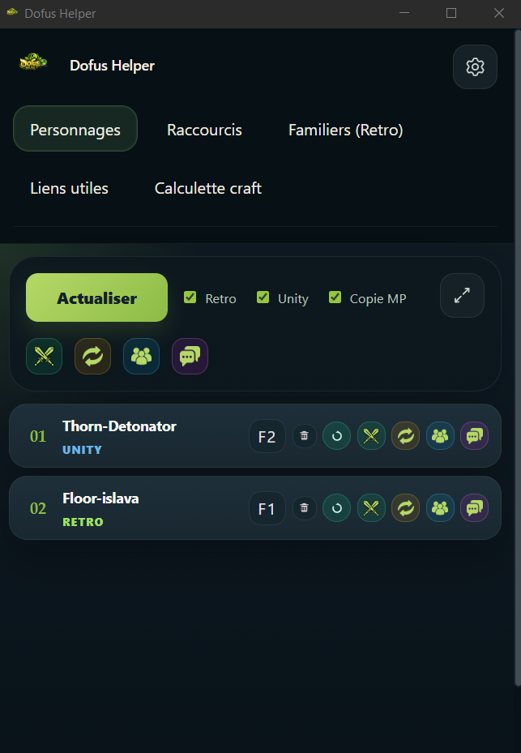

# Dofus Helper

Dofus Helper est une application Windows pour **Dofus Retro** et **Dofus Unity**.

Le dépôt a été recentré sur la version **Tauri + Vue + TypeScript**.  
L'ancien périmètre Python a été archivé dans `python.old/`.

Ce projet est un fork de Dracoon : [GitHub](https://github.com/Slyss42/Dracoon), [Twitter / X](https://x.com/Slyss42). Je vous invite à suivre son contenu !

> [!IMPORTANT]
> Ce répo Github est le seul endroit où l'application est disponible. Aucun site n'existe et n'existera. Avant de télécharger vérifier bien que vous êtes sur le bon répo.

## Structure

- `dofus-helper/` : application active
- `assets/` : ressources partagées
- `bdd_items/` : catalogues d'items
- `python.old/` : ancienne version Python archivée

## Fonctionnalités

- gestion des fenêtres personnages
- raccourcis clavier / souris
- banque de liens utiles
- calculette craft
- gestionnaire de familiers Retro

### Personnages


La vue de personnages regroupe l'ensemble des fenêtre ouvertes **Dofus Retro** et **Dofus Unity**.

Il est possible sortir une fenêtre de la rotation, ou l'ensemble des fenêtres **Dofus Retro** et/ou **Dofus Unity**.

Les notifications supportés pour le moment sont Combat / Echange / Groupe / MP.

Copie MP permet de capturer la personne qui vous a envoyé un MP, et de l'ajouter dans votre presse papier.

Il est possible d'ajouter un raccourci par Personnage.

#### Vue Réduite 

Il est possible de passer en vue compacte pour les personnages via le bouton en haut à droite.



Cet affichage ne réduit que la vue personnage, changer d'onglet remettra la taille par défaut.

### Raccourcis


L'onglet Raccourcis permet de gérer les raccourcis globaux de l'application (Changement de fenêtre).

Les touches clavier et boutons souris sont supportés.


#### Liens Utiles


Liens Utiles vous permet de vous faire une banque de lien comme des bookmarks pour ouvrir rapidement un site sur votre navigateur.

#### Calculette Craft


La calculette de craft permet de vous aider à savoir s'il vaut mieux acheter ou crafter l'item, mais aussi le bénéfice réalisable.

Il vous permet aussi simplement de voir la recette ou de suivre votre avancée pour le craft de l'item.

Les items référence aussi **Solomonk** pour **Retro** et **Dofus Book** pour **Unity** pour regarder l'item ou la panoplie sur le site.

#### Familiers (Retro)

#### Mes Familiers


L'onglet Familiers (Retro) permet de vous alerter quand vous devez nourrir votre familier.

Pour cela il suffit d'ajouter un familier (vous pouvez l'associer à un serveur et/ou un personnage), et vous aurez une petite notification sur la gauche pour vous signaler quand nourrir votre familier.

Si vous avez oublié avec quoi le nourrir, il suffit de cliquer sur le familier.


Vous pouvez cliquer sur les badges pour voir la liste des ressources sur **Solomonk**.

#### Encyclopédie


Vous permet de voir tous les familiers de Dofus Retro et avec quoi les nourrir.

#### Informations


Vous retrouverez ici quelques informations pratiques sur les familiers.

### Parametres


Retrouvez-ici les paramètres de l'application.

#### Onglets Visibles

Réordonner l'ordre des onglets dans l'applications. Vous pouvez aussi masquer certains onglets si vous ne souhaitez pas les voir.

## Développement

Pré-requis :

- Node.js
- Rust
- Visual Studio Build Tools / toolchain Windows compatible Tauri
- .NET SDK si vous voulez reconstruire le helper de notifications

Lancer en développement :

```powershell
cd .\dofus-helper
npm install
npm run tauri -- dev
```

## Build

Depuis la racine :

```powershell
.\build.ps1
```

Le script :

- lance `npm run tauri -- build` dans `dofus-helper/`
- récupère les installateurs générés
- les copie à la racine du dépôt

Tu peux aussi lancer une autre commande Tauri :

```powershell
.\build.ps1 dev
.\build.ps1 -Command build -TauriArgs '--debug'
```

## Installation

Après build, les installateurs sont copiés à la racine du dépôt (`.exe` NSIS et `.msi`).
